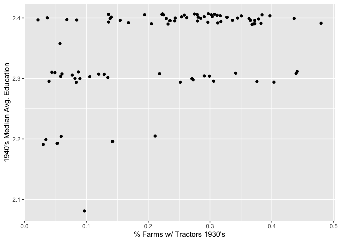
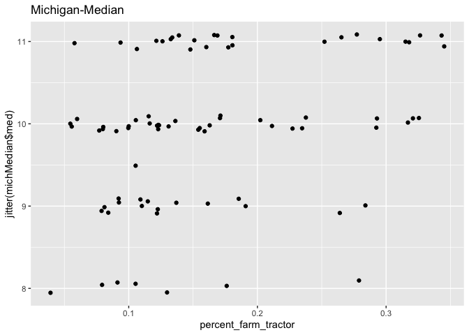
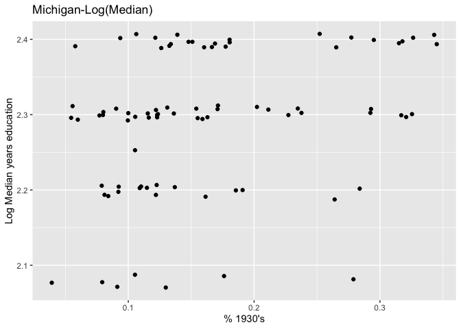
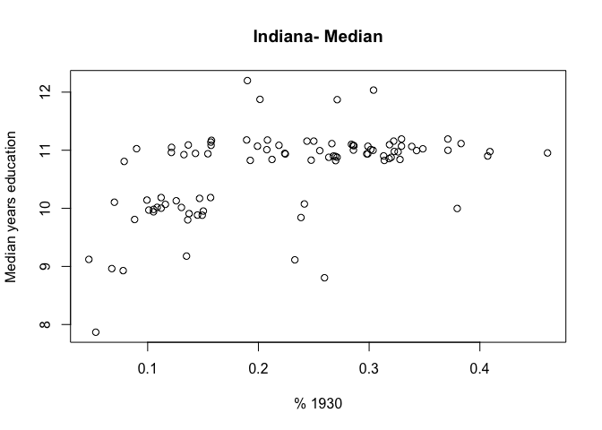
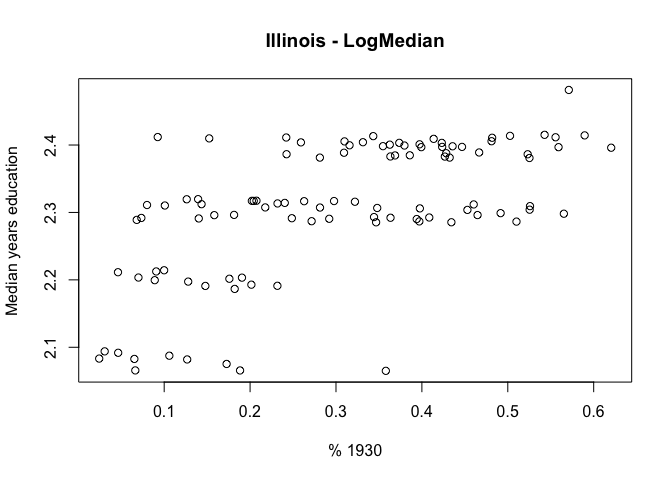
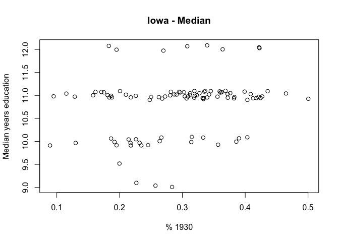
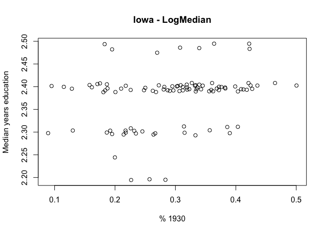
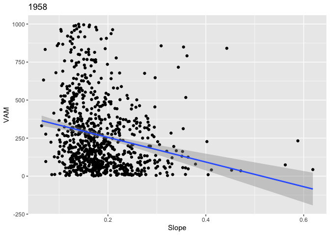

* Tractor/VAM Plots & Models:
<br>
  [Ohio](#ohio-tractor-vam-plots)
  <br>
  [Michigan](#michigan-tractor-vam-plots)
  <br>
  [Wisconsin](#wisconsin-tractor-vam-plots)
  <br>
  [Indiana](#indiana-tractor-vam-plots)
  <br>
  [Illinois](#illinois-tractor-vam-plots)
  <br>
  [Iowa](#iowa-tractor-vam-plots)


* [VAM Regression](#vam-regression)

Note about VAM Plots: Any counties with `N/A` value for VAM were replaced with 0. These are so few that I believe it has minimal effect on the trend lines. 


```r
#Function for producing EDU dataset
#
#
eduDataFunc <- function(state){
  edu_data <- subset(oth_state, stateicp == state)
  edu_data <- subset(edu_data, sex == "Male")
  edu_data <- subset(edu_data, between(age, 18,22))
  edu_data <- subset(edu_data, higrade < 20)
  edu_data <- subset(edu_data, higrade > 0)
  edu_data$higrade <- edu_data$higrade - 3
  
  reduced_edu_data <- edu_data %>%
    group_by(county) %>%
    summarise(avg = mean(higrade))
  
  return(reduced_edu_data)
}
#
#
#

eduMedianFunc <- function(state){
  edu_data <- subset(oth_state, stateicp == state)
  edu_data <- subset(edu_data, sex == "Male")
  edu_data <- subset(edu_data, between(age, 18,22))
  edu_data <- subset(edu_data, higrade < 20)
  edu_data <- subset(edu_data, higrade > 0)
  edu_data$higrade <- edu_data$higrade - 3
  
  reduced_edu_data <- edu_data %>%
    group_by(county) %>%
    summarise(med = median(higrade))
  
  return(reduced_edu_data)
}


#Function for producing Tractor set given State Abb
#
#
tractDataFunc <- function(stateAbbre){
  stateDf <- subset(df30, stateAbb == stateAbbre)
  stateDf$county <- stateDf$county * 10
  stateDf$X <- NULL
  return(stateDf)
}
#
#
#
```


---

#National Level

Looking at the national level of percent of farms with tractors over varying years. The percentages are measured on the county level. 

## % Farm Tractor 1940 vs 1930

```r
df30_40 <- merge(df30, df40, by = c("name", "stateAbb"), all = FALSE)
ggplot(data = df30_40, aes(x=percent_farm_tractor.x, y=percent_farm_tractor.y)) + geom_point() + xlab(label = "% of Farms w/ Tractors 1930's") + ylab(label = "% of Farms w/ Tractors 1940's") + ggtitle(label = "National Level")
```

<!-- -->

## % Farm Tractor 1950 vs 1940

```r
df40_50 <- merge(df40, df50, by = c("name", "stateAbb"), all = FALSE)
ggplot(data = df40_50, aes(x=percent_farm_tractor.x, y=percent_farm_tractor.y)) + geom_point() + xlab(label = "% of Farms w/ Tractors 1940's") + ylab(label = "% of Farms w/ Tractors 1950's") + ggtitle(label = "National Level")
```

<!-- -->


## % Farm Tractor 1954 vs 1950

```r
df50_54 <- merge(df50, df54, by = c("name", "stateAbb"), all = FALSE)
ggplot(data = df50_54, aes(x=percent_farm_tractor.x, y=percent_farm_tractor.y)) + geom_point() + xlab(label = "% of Farms w/ Tractors 1950") + ylab(label = "% of Farms w/ Tractors 1954") + ggtitle(label = "National Level")
```

<!-- -->

```r
df50_54$logResponse <- log(df50_54$percent_farm_tractor.y)
df50_54$logX <- log(df50_54$percent_farm_tractor.x)
ggplot(data = df50_54, aes(x=percent_farm_tractor.x, y=logResponse)) + geom_point() + xlab(label = "% of Farms w/ Tractors 1950") + ylab(label = "Log(% of Farms w/ Tractors 1954)") + ggtitle(label = "National Level") 
```

<!-- -->

```r
ggplot(data = df50_54, aes(x=logX, y=logResponse)) + geom_point() + xlab(label = "Log(% of Farms w/ Tractors 1950)") + ylab(label = "Log(% of Farms w/ Tractors 1954)") + ggtitle(label = "National Level")
```

<!-- -->


## % Farm Tractor 1964 vs 1954

```r
df54_64 <- merge(df54, df64, by = c("name", "stateAbb"), all = FALSE)
ggplot(data = df54_64, aes(x=percent_farm_tractor.x, y=percent_farm_tractor.y)) + geom_point() + xlab(label = "% of Farms w/ Tractors 1954") + ylab(label = "% of Farms w/ Tractors 1964") + ggtitle(label = "National Level")
```

<!-- -->


------------------------------------------------------------------------------------------------------------------------------------------------------------------------------------------


# OHIO<a id="ohio-tractor-vam-plots"></a>

[Mean Edu vs. Tractor](#ohio-mean-edu-model)  
<br>
[Median Edu vs. Tractor](#ohio-median-edu-model)  
<br>
[Value Added by Manufacturing](#ohio-vam)  
<br>


```r
edu <- read.dta13("ohio1940.dta")

ohio1930 <- subset(df30, stateAbb == "OH")
#Adjust FIPS code representation to match the EDU dataset
ohio1930$county <- ohio1930$county * 10
#Remove Pickaway
ohio1930 <- subset(ohio1930, county != 129)

#SUBSET to White males between 18,22 and higrade < 20 which would be graduate school
edu <- subset(edu, sex == "Male")
edu <- subset(edu, between(age, 18, 22))
edu <- subset(edu, higrade < 20)
edu$higrade <- edu$higrade - 3

#Remove all values less than 1
edu <- edu[which(edu$higrade > 0),]


#THIS IS FINAL 1940 EDU, write out to new dataset 
write.csv(edu, "ohio1940edu.csv")


newEdu <- edu %>%
  group_by(county) %>%
  summarise(avg = mean(higrade))

ohPlotSrc <- merge(newEdu, ohio1930, by = "county")

ggplot(data = ohPlotSrc, aes(x=percent_farm_tractor, y=avg)) +xlab(label = "% Farms w/ Tractors 1930") + ylab(label = "Avg Years Education") + ggtitle(label = "Ohio") + geom_point()
```

<!-- -->


## LOESS REGRESSION on 1940's Avg EDU vs % Farms w/ Tractor 1930's for Ohio

```r
ggplot(ohPlotSrc,aes(x = percent_farm_tractor, y = avg)) + geom_point()  + geom_smooth() + xlab("1930's % Farms w/ Tractors") + ylab("1940's Edu") + ggtitle("Ohio")
```

```
## `geom_smooth()` using method = 'loess' and formula 'y ~ x'
```

<!-- -->

```r
#identify(ohio1930$percent_farm_tractor, newEdu$avg)
```

##Transform ohio edu response on Log Scale 
### Ohio Mean Education Model<a id="ohio-mean-edu-model"></a>


```r
ohPlotSrc$logAvg <- log(ohPlotSrc$avg)

ohEduMod <- lm(logAvg ~ percent_farm_tractor, data = ohPlotSrc)
ggplot(data = ohPlotSrc, aes(x=percent_farm_tractor, y=logAvg)) + geom_point() + geom_smooth(method = "lm") + xlab(label = "% Farms Tractor 1930's") + ylab(label = "Log(Avg Education 1940's)") + ggtitle(label = "Log-Linear(Ohio Edu vs Tractor)") 
```

```
## `geom_smooth()` using formula 'y ~ x'
```

<!-- -->

```r
summary(ohEduMod)
```

```
## 
## Call:
## lm(formula = logAvg ~ percent_farm_tractor, data = ohPlotSrc)
## 
## Residuals:
##       Min        1Q    Median        3Q       Max 
## -0.121748 -0.021526  0.008973  0.029746  0.066242 
## 
## Coefficients:
##                      Estimate Std. Error t value Pr(>|t|)    
## (Intercept)          2.280754   0.009254 246.458  < 2e-16 ***
## percent_farm_tractor 0.186915   0.035457   5.272 9.92e-07 ***
## ---
## Signif. codes:  0 '***' 0.001 '**' 0.01 '*' 0.05 '.' 0.1 ' ' 1
## 
## Residual standard error: 0.04027 on 86 degrees of freedom
## Multiple R-squared:  0.2442,	Adjusted R-squared:  0.2354 
## F-statistic: 27.79 on 1 and 86 DF,  p-value: 9.92e-07
```


### Ohio - Median Education Plots<a id="ohio-median-edu-model"></a>

```r
eduMedian <- edu %>%
  group_by(county) %>%
  summarise(med = median(higrade))
# Log of Education Median
eduMedian$logMed <- log(eduMedian$med)

ggplot(data = ohio1930, aes(x=jitter(percent_farm_tractor), y=jitter(eduMedian$med))) + geom_point() + xlab(label = "% Farms w/ Tractors 1930's") + ylab(label = "1940's Median Avg. Education")
```

<!-- -->

```r
ggplot(data = ohio1930, aes(x=jitter(percent_farm_tractor), y=jitter(eduMedian$logMed))) + geom_point() + xlab(label = "% Farms w/ Tractors 1930's") + ylab(label = "1940's Median Avg. Education")
```

<!-- -->

### Ohio - Median Education Model

```r
ohPlotSrc_med <- merge(eduMedian, ohio1930, by = "county")
ohEduMod_med <- lm(logMed ~ percent_farm_tractor, data = ohPlotSrc_med)
summary(ohEduMod_med)
```

```
## 
## Call:
## lm(formula = logMed ~ percent_farm_tractor, data = ohPlotSrc_med)
## 
## Residuals:
##      Min       1Q   Median       3Q      Max 
## -0.23988 -0.01976  0.01381  0.03978  0.09668 
## 
## Coefficients:
##                      Estimate Std. Error t value Pr(>|t|)    
## (Intercept)           2.29588    0.01401 163.899   <2e-16 ***
## percent_farm_tractor  0.24231    0.05367   4.515    2e-05 ***
## ---
## Signif. codes:  0 '***' 0.001 '**' 0.01 '*' 0.05 '.' 0.1 ' ' 1
## 
## Residual standard error: 0.06095 on 86 degrees of freedom
## Multiple R-squared:  0.1916,	Adjusted R-squared:  0.1822 
## F-statistic: 20.38 on 1 and 86 DF,  p-value: 2.002e-05
```

```r
oh_med_df <- as.data.frame(resid(ohEduMod_med))
oh_med_df$county <- ohPlotSrc_med$name
colnames(oh_med_df) <- c( "residual", "county")
```

### Ohio Median Model County Residuals

```r
head(oh_med_df)
```

```
##      residual    county
## 1 -0.11295981     ADAMS
## 2  0.04748636     ALLEN
## 3  0.05497776   ASHLAND
## 4  0.04637276 ASHTABULA
## 5  0.08549094    ATHENS
## 6  0.02526599  AUGLAIZE
```

## OH EDU VS % Farm's w/ Tractors S.S.E.

```r
#Calculate SSE
pred_ohEdu <- predict(ohEduMod, ohPlotSrc)
#Undo log transformation
pred_ohEdu <- exp(pred_ohEdu)-1

##Sum of Square error
mean((ohPlotSrc$avg - pred_ohEdu)^2)
```

```
## [1] 1.174032
```

```r
#Residuals
ohPlotSrc$modResid <- resid(ohEduMod)
ohPlotSrc$fitted <- predict(ohEduMod)
ggplot(ohPlotSrc, aes(x = fitted, y = modResid)) + geom_point() + geom_hline(yintercept = 0, colour = "red") + ggtitle(label = "OH Edu vs Tractor Residuals")
```

<!-- -->


# OHIO Value Added by Manufacturing<a id="ohio-vam"></a>
## VAM 1947 vs % 1940

```r
#SCATTER DIAGRAM AND REGRESSION FOR OHIO VAM VS EDU
#VAM dataset
vam_ohio <- subset(vam, state == "Ohio")
#write.csv(vam_ohio, "vamOhio.csv")

#VAM in 1947 vs % Tractors 1940
vam_ohio <- subset(vam_ohio, year == 1947)
ohio1940 <- subset(df40, stateAbb == "OH")
ohio1930 <- subset(df30, stateAbb == "OH")
ohio1940$county <- ohio1940$county * 10

ggplot(data = ohio1940, aes(x=percent_farm_tractor, y=vam_ohio$VAM)) + geom_point() + xlab(label = "% Farm's w/ Tractors 1940") + ylab(label = "VAM 1947") + ggtitle(label = "Ohio VAM vs. % Tractor") + geom_smooth(method = "lm")
```

```
## `geom_smooth()` using formula 'y ~ x'
```

<!-- -->

## VAM 1958 vs % 1950

```r
ohio1950 <- subset(df50,stateAbb == "OH" )
vam_ohio1957 <- subset(vam, year == 1958 & state == "Ohio")
ohVam_mod <- lm(vam_ohio1957$VAM ~ ohio1950$percent_farm_tractor)
summary(ohVam_mod)
```

```
## 
## Call:
## lm(formula = vam_ohio1957$VAM ~ ohio1950$percent_farm_tractor)
## 
## Residuals:
##     Min      1Q  Median      3Q     Max 
## -569.63 -189.42  -25.26  194.35  616.99 
## 
## Coefficients:
##                               Estimate Std. Error t value Pr(>|t|)   
## (Intercept)                      188.7      119.4   1.581  0.11950   
## ohio1950$percent_farm_tractor    546.8      188.4   2.902  0.00526 **
## ---
## Signif. codes:  0 '***' 0.001 '**' 0.01 '*' 0.05 '.' 0.1 ' ' 1
## 
## Residual standard error: 273.3 on 57 degrees of freedom
##   (29 observations deleted due to missingness)
## Multiple R-squared:  0.1288,	Adjusted R-squared:  0.1135 
## F-statistic: 8.424 on 1 and 57 DF,  p-value: 0.005256
```

```r
ggplot(data = ohio1950, aes(x=percent_farm_tractor, y=vam_ohio1957$VAM)) + geom_point() + xlab(label = "% Farm's w/ Tractors 1950") + ylab(label = "VAM 1958") + ggtitle(label = "Ohio VAM vs. % Tractor") + geom_smooth(method = "lm")
```

```
## `geom_smooth()` using formula 'y ~ x'
```

<!-- -->

## VAM 1947 vs % 1930

```r
ohVam_mod1947 <- lm(vam_ohio$VAM ~ ohio1930$percent_farm_tractor)
summary(ohVam_mod1947)
```

```
## 
## Call:
## lm(formula = vam_ohio$VAM ~ ohio1930$percent_farm_tractor)
## 
## Residuals:
##     Min      1Q  Median      3Q     Max 
## -447.78 -210.40  -43.62  235.08  562.43 
## 
## Coefficients:
##                               Estimate Std. Error t value Pr(>|t|)    
## (Intercept)                     214.00      62.37   3.431 0.000959 ***
## ohio1930$percent_farm_tractor   827.97     240.82   3.438 0.000938 ***
## ---
## Signif. codes:  0 '***' 0.001 '**' 0.01 '*' 0.05 '.' 0.1 ' ' 1
## 
## Residual standard error: 269.5 on 79 degrees of freedom
##   (7 observations deleted due to missingness)
## Multiple R-squared:  0.1302,	Adjusted R-squared:  0.1191 
## F-statistic: 11.82 on 1 and 79 DF,  p-value: 0.0009376
```

```r
ggplot(data = ohio1930, aes(x=percent_farm_tractor, y=vam_ohio$VAM)) + geom_point() + xlab(label = "% Farm's w/ Tractors 1930") + ylab(label = "VAM 1947") + ggtitle(label = "Ohio VAM vs. % Tractor") + geom_smooth(method = "lm")
```

```
## `geom_smooth()` using formula 'y ~ x'
```

<!-- -->

------------------------------------------------------------------------------------------------------------------------------------------------------------------------------------------

1940 Census Dataset; Pull other midwest states from here

```r
# NEW DATASET! -> EDU 1940 vs % Tractor 1930
#oth_state <- read.dta13("cen1940A.dta")
#saveRDS(oth_state, "midwest_state.rds")

# Restore the data object. Shit is huge...I was tired of loading it over and over...
oth_state = readRDS(file = "midwest_state.rds")

#States:
# Michigan, Wisconsin, Indiana, Illinois, Iowa, Minnesota
```


------------------------------------------------------------------------------------------------------------------------------------------------------------------------------------------

# MICHIGAN<a id="michigan-tractor-vam-plots"></a>

```
## [1] "use `stateicp` as locations\nage between 18,22\nhigrade < 20"
```

#LOESS REGRESSION on EDU vs % Tractor

```r
ggplot(michPlotSrc,aes(x = percent_farm_tractor, y = avg)) + geom_point()  + geom_smooth() + xlab("1930's % Tractor") + ylab("1940 Avg. Edu") + ggtitle("Michigan")
```

```
## `geom_smooth()` using method = 'loess' and formula 'y ~ x'
```

<!-- -->


#Transform response on Log Scale

```r
michPlotSrc$logAvg <- log(michPlotSrc$avg)

ggplot(data = michPlotSrc, aes(x=percent_farm_tractor, y=logAvg)) + geom_point() + ggtitle(label = "Log-Linear") 
```

<!-- -->

```r
michEduMod <- lm(logAvg ~ percent_farm_tractor, data = michPlotSrc)
summary(michEduMod)
```

```
## 
## Call:
## lm(formula = logAvg ~ percent_farm_tractor, data = michPlotSrc)
## 
## Residuals:
##       Min        1Q    Median        3Q       Max 
## -0.219400 -0.036979  0.000761  0.041468  0.100975 
## 
## Coefficients:
##                      Estimate Std. Error t value Pr(>|t|)    
## (Intercept)           2.25242    0.01312 171.704   <2e-16 ***
## percent_farm_tractor  0.17868    0.07160   2.496   0.0146 *  
## ---
## Signif. codes:  0 '***' 0.001 '**' 0.01 '*' 0.05 '.' 0.1 ' ' 1
## 
## Residual standard error: 0.05275 on 81 degrees of freedom
## Multiple R-squared:  0.07139,	Adjusted R-squared:  0.05993 
## F-statistic: 6.228 on 1 and 81 DF,  p-value: 0.01461
```

```r
#Residuals
michPlotSrc$modResid <- resid(michEduMod)
michPlotSrc$fitted <- predict(michEduMod)
ggplot(michPlotSrc, aes(x = fitted, y = modResid)) + geom_point() + geom_hline(yintercept = 0, colour = "red") + ggtitle(label = "MI Edu vs Tractor Residuals")
```

<!-- -->

#Michigan - Median

```r
michMedian <- eduMedianFunc("Michigan")

ggplot(data = mich_tract, aes(x=percent_farm_tractor, y=jitter(michMedian$med))) + geom_point() + ggtitle(label = "Michigan-Median")
```

<!-- -->

```r
michMedian$logMed <- log(michMedian$med)

ggplot(data = mich_tract, aes(x=jitter(percent_farm_tractor), y=jitter(michMedian$logMed))) + geom_point() + xlab("% 1930's") + ylab("Log Median years education") + ggtitle("Michigan-Log(Median)")
```

<!-- -->

### Michigan - Median Model

```r
plotSrc_med_mich <- merge(michMedian, mich_tract, by = "county")
michEduMod_med <- lm(logMed ~ percent_farm_tractor, data = plotSrc_med_mich)
summary(michEduMod_med)
```

```
## 
## Call:
## lm(formula = logMed ~ percent_farm_tractor, data = plotSrc_med_mich)
## 
## Residuals:
##      Min       1Q   Median       3Q      Max 
## -0.25098 -0.06656  0.02238  0.05473  0.14252 
## 
## Coefficients:
##                      Estimate Std. Error t value Pr(>|t|)    
## (Intercept)           2.23574    0.02284  97.892  < 2e-16 ***
## percent_farm_tractor  0.33943    0.12465   2.723  0.00792 ** 
## ---
## Signif. codes:  0 '***' 0.001 '**' 0.01 '*' 0.05 '.' 0.1 ' ' 1
## 
## Residual standard error: 0.09184 on 81 degrees of freedom
## Multiple R-squared:  0.08386,	Adjusted R-squared:  0.07255 
## F-statistic: 7.415 on 1 and 81 DF,  p-value: 0.007921
```

```r
mi_med_df <- as.data.frame(resid(michEduMod_med))
mi_med_df$county <- plotSrc_med_mich$name
colnames(mi_med_df) <- c( "residual", "county")
```

### Michigan Median Model County Residuals

```r
mi_med_df
```

```
##        residual            county
## 1  -0.187275178            ALCONA
## 2  -0.085014801             ALGER
## 3   0.008819658           ALLEGAN
## 4  -0.079919458            ALPENA
## 5  -0.077488032            ANTRIM
## 6  -0.200353056            ARENAC
## 7   0.025425850            BARAGA
## 8   0.110906381             BARRY
## 9  -0.012837076               BAY
## 10  0.031026497            BENZIE
## 11  0.107743596           BERRIEN
## 12  0.008707873            BRANCH
## 13  0.111953523           CALHOUN
## 14  0.120925711              CASS
## 15  0.036165627        CHARLEVOIX
## 16 -0.065297665         CHEBOYGAN
## 17  0.020599745          CHIPPEWA
## 18  0.033014005             CLARE
## 19 -0.042063207           CLINTON
## 20  0.014172802          CRAWFORD
## 21  0.012887339             DELTA
## 22  0.101942375         DICKINSON
## 23  0.072106438             EATON
## 24 -0.066056828             EMMET
## 25  0.055198261           GENESEE
## 26 -0.069792934           GLADWIN
## 27  0.142516707           GOGEBIC
## 28  0.011545445    GRAND TRAVERSE
## 29 -0.032579808           GRATIOT
## 30  0.100856541         HILLSDALE
## 31  0.039725469          HOUGHTON
## 32 -0.250981531             HURON
## 33  0.068038995            INGHAM
## 34 -0.128137603             IONIA
## 35  0.027636661             IOSCO
## 36  0.130371319              IRON
## 37 -0.101475239          ISABELLA
## 38  0.105659303           JACKSON
## 39  0.100879266         KALAMAZOO
## 40 -0.075924113          KALKASKA
## 41  0.104813894              KENT
## 42 -0.169611558          KEWEENAW
## 43  0.046514135              LAKE
## 44 -0.216084187            LAPEER
## 45 -0.075546269          LEELANAU
## 46  0.044995306           LENAWEE
## 47  0.076575847        LIVINGSTON
## 48 -0.001805789              LUCE
## 49 -0.093317083 MACKINAC/MICHILIM
## 50  0.061968971            MACOMB
## 51  0.039619066          MANISTEE
## 52  0.126050759         MARQUETTE
## 53  0.116743765             MASON
## 54  0.040682349           MECOSTA
## 55  0.025128222         MENOMINEE
## 56 -0.004886346           MIDLAND
## 57 -0.183214337         MISSAUKEE
## 58 -0.032406605            MONROE
## 59  0.024902446          MONTCALM
## 60  0.022383630       MONTMORENCY
## 61  0.114975307          MUSKEGON
## 62 -0.020210397           NEWAYGO
## 63  0.051362076           OAKLAND
## 64  0.027366523            OCEANA
## 65 -0.069876049            OGEMAW
## 66 -0.080123158         ONTONAGON
## 67  0.048305016           OSCEOLA
## 68 -0.010300206            OSCODA
## 69 -0.067060519            OTSEGO
## 70  0.025111206            OTTAWA
## 71 -0.192049448      PRESQUE ISLE
## 72  0.032899974         ROSCOMMON
## 73 -0.040745153           SAGINAW
## 74 -0.013826630          ST CLAIR
## 75  0.117125263         ST JOSEPH
## 76 -0.103298228           SANILAC
## 77  0.014549838       SCHOOLCRAFT
## 78 -0.043640768        SHIAWASSEE
## 79 -0.134888560           TUSCOLA
## 80  0.119313235         VAN BUREN
## 81  0.054252119         WASHTENAW
## 82  0.045686965             WAYNE
## 83  0.047936516           WEXFORD
```


#SCATTER DIAGRAM AND REGRESSION FOR MICHIGAN VAM VS EDU

```r
mich_vam <- subset(vam, state == "Michigan" & year == 1947)
ggplot(data=mich_tract, aes(x=percent_farm_tractor, y=mich_vam$VAM)) + geom_point() + geom_smooth(method = "lm") + ggtitle("Michigan VAM 1947 vs % Tractor 1940")
```

```
## `geom_smooth()` using formula 'y ~ x'
```

<!-- -->

```r
outlierMich <- michPlotSrc[44,]
outlierMich
```

```
##    county      avg year state   name percent_farm_tractor stateAbb  fips
## 44    870 7.881265 1930    26 LAPEER            0.1761294       MI 26087
##    colorID   logAvg   modResid   fitted
## 44       3 2.064488 -0.2194003 2.283889
```


## MI EDU VS % SSE

```r
#Calculate SSE
pred_michEdu <- predict(michEduMod, michPlotSrc)
#Undo log transformation
pred_michEdu <- exp(pred_michEdu)-1

mean((michPlotSrc$avg - pred_michEdu)^2)
```

```
## [1] 1.276815
```

## VAM 1958 vs % 1950

```r
mich1930 <- subset(df30,stateAbb == "MI" )
mich1950 <- subset(df50,stateAbb == "MI" )
vam_mich1957 <- subset(vam, year == 1958 & state == "Michigan")
michVam_mod <- lm(vam_mich1957$VAM ~ mich1950$percent_farm_tractor)
summary(michVam_mod)
```

```
## 
## Call:
## lm(formula = vam_mich1957$VAM ~ mich1950$percent_farm_tractor)
## 
## Residuals:
##     Min      1Q  Median      3Q     Max 
## -365.46 -196.66  -25.15  184.44  503.44 
## 
## Coefficients:
##                               Estimate Std. Error t value Pr(>|t|)
## (Intercept)                      243.3      202.0   1.204    0.233
## mich1950$percent_farm_tractor    140.9      297.2   0.474    0.637
## 
## Residual standard error: 241.4 on 62 degrees of freedom
##   (19 observations deleted due to missingness)
## Multiple R-squared:  0.003611,	Adjusted R-squared:  -0.01246 
## F-statistic: 0.2247 on 1 and 62 DF,  p-value: 0.6372
```

```r
ggplot(data=mich1950, aes(x=percent_farm_tractor, y=vam_mich1957$VAM)) + geom_point() + ggtitle("Michigan - 1957 VAM vs 1950 %")
```

<!-- -->

## VAM 1947 vs % 1930

```r
vam_mich1947 <- subset(vam, year == 1947 & state == "Michigan")
michVam_mod1947 <- lm(vam_mich1947$VAM ~ mich1930$percent_farm_tractor)
summary(michVam_mod1947)
```

```
## 
## Call:
## lm(formula = vam_mich1947$VAM ~ mich1930$percent_farm_tractor)
## 
## Residuals:
##     Min      1Q  Median      3Q     Max 
## -427.69 -191.52   -8.99  126.28  552.66 
## 
## Coefficients:
##                               Estimate Std. Error t value Pr(>|t|)    
## (Intercept)                      71.76      62.43    1.15    0.254    
## mich1930$percent_farm_tractor  1542.55     349.03    4.42 3.24e-05 ***
## ---
## Signif. codes:  0 '***' 0.001 '**' 0.01 '*' 0.05 '.' 0.1 ' ' 1
## 
## Residual standard error: 243.3 on 76 degrees of freedom
##   (5 observations deleted due to missingness)
## Multiple R-squared:  0.2045,	Adjusted R-squared:  0.194 
## F-statistic: 19.53 on 1 and 76 DF,  p-value: 3.24e-05
```

```r
ggplot(data=mich1930, aes(percent_farm_tractor, vam_mich1947$VAM)) + ggtitle("Michigan - 1947 VAM vs 1930 %")  + geom_point()
```

<!-- -->

-------------------------------------------------------------------------------------------------------------------------------------------------------------------------------------------------

# WISCONSIN<a id="wisconsin-tractor-vam-plots"></a>


```r
#Wisconsin Edu
wis_edu <- eduDataFunc("Wisconsin")

#Wisconsin Tractor
wis_tract <- tractDataFunc("WI")

plot(wis_tract$percent_farm_tractor, wis_edu$avg, xlab = "1930 % Tractor", ylab = "1940 Avg. Edu", main = "Wisconsin")
```

<!-- -->

```r
plot(log(wis_tract$percent_farm_tractor), wis_edu$avg)
```

<!-- -->

```r
wisPlotSrc <- merge(wis_edu, wis_tract, by = "county")

#LOESS REGRESSION on EDU vs % Tractor
ggplot(wisPlotSrc,aes(x = percent_farm_tractor, y = avg)) + geom_point()  + geom_smooth() + xlab("1930's % Tractor") + ylab("1940 Avg. Edu") + ggtitle("Wisconsin")
```

```
## `geom_smooth()` using method = 'loess' and formula 'y ~ x'
```

<!-- -->

```r
#Transform response on Log Scale
wisPlotSrc$logAvg <- log(wisPlotSrc$avg)
wisPlotSrc$logX <- log(wisPlotSrc$percent_farm_tractor)

plot(wisPlotSrc$percent_farm_tractor, wisPlotSrc$logAvg, main = "Log-Linear")
```

<!-- -->

```r
wisEduMod <- lm(logAvg ~ percent_farm_tractor, data = wisPlotSrc)
summary(wisEduMod)
```

```
## 
## Call:
## lm(formula = logAvg ~ percent_farm_tractor, data = wisPlotSrc)
## 
## Residuals:
##       Min        1Q    Median        3Q       Max 
## -0.083969 -0.025500 -0.000201  0.020619  0.092817 
## 
## Coefficients:
##                      Estimate Std. Error t value Pr(>|t|)    
## (Intercept)          2.265011   0.009967 227.256  < 2e-16 ***
## percent_farm_tractor 0.100321   0.035121   2.856  0.00566 ** 
## ---
## Signif. codes:  0 '***' 0.001 '**' 0.01 '*' 0.05 '.' 0.1 ' ' 1
## 
## Residual standard error: 0.03962 on 69 degrees of freedom
## Multiple R-squared:  0.1057,	Adjusted R-squared:  0.09279 
## F-statistic: 8.159 on 1 and 69 DF,  p-value: 0.005656
```

```r
#Residuals
wisPlotSrc$modResid <- resid(wisEduMod)
wisPlotSrc$fitted <- predict(wisEduMod)
ggplot(wisPlotSrc, aes(x = fitted, y = modResid)) + geom_point() + geom_hline(yintercept = 0, colour = "red") + ggtitle(label = "WI Edu vs Tractor Residuals")
```

<!-- -->

```r
#SCATTER DIAGRAM AND REGRESSION FOR WISCONSIN VAM VS EDU
wis_vam <- subset(vam, state == "Wisconsin" & year == 1947)
wis_vam[is.na(wis_vam)] <- 0
plot(wis_tract$percent_farm_tractor, wis_vam$VAM, xlab = "% 1940", ylab = "VAM 1947", ylim = c(0,1000), main = "Wisconsin VAM vs % Tractor")
abline(lm(wis_vam$VAM ~ wis_tract$percent_farm_tractor))
```

<!-- -->


## WI EDU VS % SSE

```r
#Calculate SSE
pred_wisEdu <- predict(wisEduMod, wisPlotSrc)
#Undo log transformation
pred_wisEdu <- exp(pred_wisEdu)-1

mean((wisPlotSrc$avg - pred_wisEdu)^2)
```

```
## [1] 1.164601
```


## VAM 1958 vs % 1950

```r
wis1950 <- subset(df50,stateAbb == "WI" )
wis1930 <- subset(df30,stateAbb == "WI" )
vam_wis1957 <- subset(vam, year == 1958 & state == "Wisconsin")
wisVam_mod <- lm(vam_wis1957$VAM ~ wis1950$percent_farm_tractor)
summary(wisVam_mod)
```

```
## 
## Call:
## lm(formula = vam_wis1957$VAM ~ wis1950$percent_farm_tractor)
## 
## Residuals:
##     Min      1Q  Median      3Q     Max 
## -333.26 -192.11  -27.48  103.04  676.52 
## 
## Coefficients:
##                              Estimate Std. Error t value Pr(>|t|)
## (Intercept)                    -2.341    237.072  -0.010    0.992
## wis1950$percent_farm_tractor  497.488    326.784   1.522    0.134
## 
## Residual standard error: 251.5 on 54 degrees of freedom
##   (15 observations deleted due to missingness)
## Multiple R-squared:  0.04115,	Adjusted R-squared:  0.0234 
## F-statistic: 2.318 on 1 and 54 DF,  p-value: 0.1337
```

```r
plot(wis1950$percent_farm_tractor, vam_wis1957$VAM, main = "Wisconsin - 1957 VAM vs 1950 %")
abline(wisVam_mod, col = "red")
```

<!-- -->

## VAM 1947 vs % 1930

```r
vam_wis1947 <- subset(vam, year == 1947 & state == "Wisconsin")
wisVam_mod1947 <- lm(vam_wis1947$VAM ~ wis1930$percent_farm_tractor)
summary(wisVam_mod1947)
```

```
## 
## Call:
## lm(formula = vam_wis1947$VAM ~ wis1930$percent_farm_tractor)
## 
## Residuals:
##     Min      1Q  Median      3Q     Max 
## -484.24 -152.21  -90.96  135.29  674.42 
## 
## Coefficients:
##                              Estimate Std. Error t value Pr(>|t|)    
## (Intercept)                     55.46      62.58   0.886    0.379    
## wis1930$percent_farm_tractor  1046.06     228.27   4.583  2.1e-05 ***
## ---
## Signif. codes:  0 '***' 0.001 '**' 0.01 '*' 0.05 '.' 0.1 ' ' 1
## 
## Residual standard error: 243.9 on 66 degrees of freedom
##   (3 observations deleted due to missingness)
## Multiple R-squared:  0.2414,	Adjusted R-squared:  0.2299 
## F-statistic:    21 on 1 and 66 DF,  p-value: 2.098e-05
```

```r
plot(wis1930$percent_farm_tractor, vam_wis1947$VAM, main = "Wisconsin - 1947 VAM vs 1930 %")
abline(wisVam_mod1947, col = "red")
```

<!-- -->

-------------------------------------------------------------------------------------------------------------------------------------------------------------------------------------------------

# INDIANA<a id="indiana-tractor-vam-plots"></a>

```r
#Indiana Edu
in_edu <- eduDataFunc("Indiana")

#Indiana Tractor
in_tract <- tractDataFunc("IN")

plot(in_tract$percent_farm_tractor, in_edu$avg, xlab = "1930 % Tractor", ylab = "1940 Avg. Edu", main = "Indiana")
```

<!-- -->

```r
inPlotSrc <- merge(in_edu, in_tract, by = "county")

#LOESS REGRESSION on EDU vs % Tractor
ggplot(inPlotSrc,aes(x = percent_farm_tractor, y = avg)) + geom_point()  + geom_smooth() + xlab("1930's % Tractor") + ylab("1940 Avg. Edu") + ggtitle("Indiana")
```

```
## `geom_smooth()` using method = 'loess' and formula 'y ~ x'
```

<!-- -->


#Transform response on Log Scale

```r
inPlotSrc$logAvg <- log(inPlotSrc$avg)

plot(inPlotSrc$percent_farm_tractor, inPlotSrc$logAvg, main = "Log-Linear")
```

<!-- -->

```r
inEduMod <- lm(logAvg ~ percent_farm_tractor, data = inPlotSrc)
summary(inEduMod)
```

```
## 
## Call:
## lm(formula = logAvg ~ percent_farm_tractor, data = inPlotSrc)
## 
## Residuals:
##       Min        1Q    Median        3Q       Max 
## -0.128838 -0.020547  0.000339  0.027807  0.068493 
## 
## Coefficients:
##                      Estimate Std. Error t value Pr(>|t|)    
## (Intercept)          2.271406   0.009384 242.049  < 2e-16 ***
## percent_farm_tractor 0.243673   0.038546   6.322 9.74e-09 ***
## ---
## Signif. codes:  0 '***' 0.001 '**' 0.01 '*' 0.05 '.' 0.1 ' ' 1
## 
## Residual standard error: 0.03588 on 90 degrees of freedom
## Multiple R-squared:  0.3075,	Adjusted R-squared:  0.2998 
## F-statistic: 39.96 on 1 and 90 DF,  p-value: 9.74e-09
```

```r
#Residuals
inPlotSrc$modResid <- resid(inEduMod)
inPlotSrc$fitted <- predict(inEduMod)
ggplot(inPlotSrc, aes(x = fitted, y = modResid)) + geom_point() + geom_hline(yintercept = 0, colour = "red") + ggtitle(label = "IN Edu vs Tractor Residuals")
```

<!-- -->

#SCATTER DIAGRAM AND REGRESSION FOR Indiana VAM VS EDU

```r
in_vam <- subset(vam, state == "Indiana" & year == 1947)
rownames(in_vam) <- 1:nrow(in_vam)
in_vam <- in_vam[-75,]
rownames(in_vam) <- 1:nrow(in_vam)
in_vam[is.na(in_vam)] <- 0
plot(in_tract$percent_farm_tractor, in_vam$VAM, xlab = "% 1940", ylab = "VAM 1947", ylim = c(0,1000), main = "Indiana VAM vs % Tractor")
abline(lm(in_vam$VAM ~ in_tract$percent_farm_tractor))
```

<!-- -->

#Indiana - Median

```r
inMedian <- eduMedianFunc("Indiana")

plot(jitter(in_tract$percent_farm_tractor), jitter(inMedian$med), xlab = "% 1930", ylab ="Median years education", main = "Indiana- Median")
```

<!-- -->

```r
inMedian$logMed <- log(inMedian$med)

plot(jitter(in_tract$percent_farm_tractor), jitter(inMedian$logMed), xlab = "% 1930", ylab ="Median years education", main = "Indiana- LogMedian")
```

<!-- -->


### Indiana - Median Model

```r
plotSrc_med_in <- merge(inMedian, in_tract, by = "county")
inEduMod_med <- lm(logMed ~ percent_farm_tractor, data = plotSrc_med_in)
summary(inEduMod_med)
```

```
## 
## Call:
## lm(formula = logMed ~ percent_farm_tractor, data = plotSrc_med_in)
## 
## Residuals:
##       Min        1Q    Median        3Q       Max 
## -0.217651 -0.021463 -0.000837  0.035208  0.135319 
## 
## Coefficients:
##                      Estimate Std. Error t value Pr(>|t|)    
## (Intercept)           2.27671    0.01582   143.9  < 2e-16 ***
## percent_farm_tractor  0.38349    0.06500     5.9  6.3e-08 ***
## ---
## Signif. codes:  0 '***' 0.001 '**' 0.01 '*' 0.05 '.' 0.1 ' ' 1
## 
## Residual standard error: 0.0605 on 90 degrees of freedom
## Multiple R-squared:  0.2789,	Adjusted R-squared:  0.2709 
## F-statistic: 34.81 on 1 and 90 DF,  p-value: 6.296e-08
```

```r
in_med_df <- as.data.frame(resid(inEduMod_med))
in_med_df$county <- plotSrc_med_in$name
colnames(in_med_df) <- c( "residual", "county")
```


### Indiana Median Model County Residuals

```r
in_med_df
```

```
##         residual      county
## 1  -0.0039011654       ADAMS
## 2  -0.0045533470       ALLEN
## 3   0.0485600175 BARTHOLOMEW
## 4  -0.0556421083      BENTON
## 5   0.0397637243   BLACKFORD
## 6   0.0172311300       BOONE
## 7  -0.0974781526       BROWN
## 8  -0.0349227644     CARROLL
## 9   0.0353692131        CASS
## 10 -0.0304488200       CLARK
## 11  0.0702713112        CLAY
## 12 -0.0050793908     CLINTON
## 13 -0.2176513073    CRAWFORD
## 14 -0.0297271964     DAVIESS
## 15 -0.0268200706    DEARBORN
## 16 -0.0124768965     DECATUR
## 17  0.0184916342     DE KALB
## 18  0.0351542336    DELAWARE
## 19 -0.1312904249      DUBOIS
## 20  0.0608813534     ELKHART
## 21 -0.1196820773     FAYETTE
## 22 -0.0241780504       FLOYD
## 23  0.0115811945    FOUNTAIN
## 24 -0.1688033073    FRANKLIN
## 25  0.0746289970      FULTON
## 26  0.0253089310      GIBSON
## 27 -0.0007629611       GRANT
## 28  0.0866655157      GREENE
## 29 -0.0014830516    HAMILTON
## 30  0.0116994290     HANCOCK
## 31 -0.0128748566    HARRISON
## 32  0.0177421484   HENDRICKS
## 33  0.0178206224       HENRY
## 34 -0.0025762048      HOWARD
## 35  0.1042119985  HUNTINGTON
## 36 -0.0313739026     JACKSON
## 37  0.0069599110      JASPER
## 38  0.0473013013         JAY
## 39 -0.0122367435   JEFFERSON
## 40 -0.0157585697    JENNINGS
## 41 -0.0086250188     JOHNSON
## 42  0.0122629645        KNOX
## 43  0.0662756138   KOSCIUSKO
## 44 -0.0317447280    LAGRANGE
## 45 -0.0050625322        LAKE
## 46  0.0047870347    LA PORTE
## 47 -0.0144954635    LAWRENCE
## 48  0.0113978554     MADISON
## 49  0.0066256475      MARION
## 50  0.0609437234    MARSHALL
## 51 -0.0171457002      MARTIN
## 52  0.0190393905       MIAMI
## 53 -0.0009467869      MONROE
## 54  0.0065750034  MONTGOMERY
## 55  0.0373660608      MORGAN
## 56 -0.0211253141      NEWTON
## 57  0.0415637340       NOBLE
## 58  0.0745590830        OHIO
## 59 -0.0223773748      ORANGE
## 60  0.0909766279        OWEN
## 61  0.0448138997       PARKE
## 62 -0.1093545276       PERRY
## 63 -0.0145292159        PIKE
## 64  0.0201064860      PORTER
## 65 -0.1790683618       POSEY
## 66 -0.0667393709     PULASKI
## 67  0.0619769431      PUTNAM
## 68  0.0232313852    RANDOLPH
## 69 -0.0342631411      RIPLEY
## 70 -0.0356922635        RUSH
## 71  0.0262023096   ST JOSEPH
## 72 -0.0171502153       SCOTT
## 73  0.0008867328      SHELBY
## 74 -0.0079500668     SPENCER
## 75 -0.0655714442      STARKE
## 76  0.1309497809     STEUBEN
## 77  0.0687769074    SULLIVAN
## 78 -0.1054192161 SWITZERLAND
## 79 -0.0023580977  TIPPECANOE
## 80  0.0011144066      TIPTON
## 81 -0.0256990445       UNION
## 82  0.0413615048 VANDERBURGH
## 83  0.0276761811  VERMILLION
## 84  0.0607328271        VIGO
## 85  0.0055664474      WABASH
## 86 -0.0211584038      WARREN
## 87 -0.0186099550     WARRICK
## 88 -0.0263503943  WASHINGTON
## 89 -0.0009102887       WAYNE
## 90  0.0916333530       WELLS
## 91 -0.0102948964       WHITE
## 92  0.1353186218     WHITLEY
```
## IN EDU VS % SSE

```r
#Calculate SSE
pred_inEdu <- predict(inEduMod, inPlotSrc)
#Undo log transformation
pred_inEdu <- exp(pred_inEdu)-1

mean((inPlotSrc$avg - pred_inEdu)^2)
```

```
## [1] 1.13942
```

## VAM 1958 vs % 1950

```r
in1950 <- subset(df50,stateAbb == "IN" )
in1930 <- subset(df30,stateAbb == "IN" )
vam_in1957 <- subset(vam, year == 1958 & state == "Indiana")
inVam_mod <- lm(vam_in1957$VAM ~ in1950$percent_farm_tractor)
summary(inVam_mod)
```

```
## 
## Call:
## lm(formula = vam_in1957$VAM ~ in1950$percent_farm_tractor)
## 
## Residuals:
##     Min      1Q  Median      3Q     Max 
## -450.65 -242.12  -46.76  201.85  583.08 
## 
## Coefficients:
##                             Estimate Std. Error t value Pr(>|t|)
## (Intercept)                    142.0      173.0   0.821    0.415
## in1950$percent_farm_tractor    395.2      269.2   1.468    0.147
## 
## Residual standard error: 289 on 69 degrees of freedom
##   (21 observations deleted due to missingness)
## Multiple R-squared:  0.03028,	Adjusted R-squared:  0.01623 
## F-statistic: 2.155 on 1 and 69 DF,  p-value: 0.1467
```

```r
plot(in1950$percent_farm_tractor, vam_in1957$VAM, main = "Indiana - 1957 VAM vs 1950 %")
abline(inVam_mod, col = "red")
```

<!-- -->

## VAM 1947 vs % 1930

```r
vam_in1947 <- subset(vam, year == 1947 & state == "Indiana")
vam_in1947 <- vam_in1947[-75,]

inVam_mod1947 <- lm(vam_in1947$VAM ~ in1930$percent_farm_tractor)
summary(inVam_mod1947)
```

```
## 
## Call:
## lm(formula = vam_in1947$VAM ~ in1930$percent_farm_tractor)
## 
## Residuals:
##     Min      1Q  Median      3Q     Max 
## -325.84 -212.46  -97.32  134.94  702.92 
## 
## Coefficients:
##                             Estimate Std. Error t value Pr(>|t|)   
## (Intercept)                   244.49      72.15   3.389  0.00108 **
## in1930$percent_farm_tractor   232.64     303.97   0.765  0.44627   
## ---
## Signif. codes:  0 '***' 0.001 '**' 0.01 '*' 0.05 '.' 0.1 ' ' 1
## 
## Residual standard error: 269.6 on 82 degrees of freedom
##   (8 observations deleted due to missingness)
## Multiple R-squared:  0.007092,	Adjusted R-squared:  -0.005016 
## F-statistic: 0.5857 on 1 and 82 DF,  p-value: 0.4463
```

```r
plot(in1930$percent_farm_tractor, vam_in1947$VAM, main = "Indiana - 1947 VAM vs 1930 %")
abline(inVam_mod1947, col = "red")
```

<!-- -->
-------------------------------------------------------------------------------------------------------------------------------------------------------------------------------------------------

# Illinois<a id="illinois-tractor-vam-plots"></a>


```r
#Illinois Edu
il_edu <- eduDataFunc("Illinois")

il_edu_med <- eduMedianFunc("Illinois")

#Illinois Tractor
il_tract <- tractDataFunc("IL")

plot(il_tract$percent_farm_tractor, il_edu$avg, xlab = "1930 % Tractor", ylab = "1940 Avg. Edu", main = "Illinois")
```

<!-- -->

```r
plot(il_tract$percent_farm_tractor, il_edu_med$med, xlab = "1930 % Tractor", ylab = "1940 Med. Edu", main = "Illinois")
```

<!-- -->

```r
ilPlotSrc <- merge(il_edu, il_tract, by = "county")
```
#LOESS REGRESSION on EDU vs % Tractor

```r
ggplot(ilPlotSrc,aes(x = percent_farm_tractor, y = avg)) + geom_point()  + geom_smooth() + xlab("1930's % Tractor") + ylab("1940 Avg. Edu") + ggtitle("Illinois")
```

```
## `geom_smooth()` using method = 'loess' and formula 'y ~ x'
```

<!-- -->

#Transform response on Log Scale

```r
ilPlotSrc$logAvg <- log(ilPlotSrc$avg)

plot(ilPlotSrc$percent_farm_tractor, ilPlotSrc$logAvg, main = "Log-Linear")
```

<!-- -->

```r
ilEduMod <- lm(logAvg ~ percent_farm_tractor, data = ilPlotSrc)
summary(ilEduMod)
```

```
## 
## Call:
## lm(formula = logAvg ~ percent_farm_tractor, data = ilPlotSrc)
## 
## Residuals:
##       Min        1Q    Median        3Q       Max 
## -0.228625 -0.017533  0.009969  0.029582  0.071982 
## 
## Coefficients:
##                      Estimate Std. Error t value Pr(>|t|)    
## (Intercept)           2.22397    0.01067 208.505  < 2e-16 ***
## percent_farm_tractor  0.22051    0.03129   7.047 2.39e-10 ***
## ---
## Signif. codes:  0 '***' 0.001 '**' 0.01 '*' 0.05 '.' 0.1 ' ' 1
## 
## Residual standard error: 0.04953 on 100 degrees of freedom
## Multiple R-squared:  0.3318,	Adjusted R-squared:  0.3251 
## F-statistic: 49.66 on 1 and 100 DF,  p-value: 2.385e-10
```

#Residuals - Mean Model

```r
ilPlotSrc$modResid <- resid(ilEduMod)
ilPlotSrc$fitted <- predict(ilEduMod)
ggplot(ilPlotSrc, aes(x = fitted, y = modResid)) + geom_point() + geom_hline(yintercept = 0, colour = "red") + ggtitle(label = "IL Edu vs Tractor Residuals")
```

<!-- -->


#SCATTER DIAGRAM AND REGRESSION FOR Illinois VAM VS EDU

```r
il_vam <- subset(vam, state == "Illinois" & year == 1947)
rownames(il_vam) <- 1:nrow(il_vam)
il_vam[is.na(il_vam)] <- 0
plot(il_tract$percent_farm_tractor, il_vam$VAM, xlab = "% 1940", ylab = "VAM 1947", ylim = c(0,1000), main = "Illinois VAM vs % Tractor")
abline(lm(il_vam$VAM ~ il_tract$percent_farm_tractor))
```

<!-- -->

```r
#Identify outliers
 #outlier <- ilPlotSrc[c(35,54),]
 #outlier
```

#Illinois - Median

```r
ilMedian <- eduMedianFunc("Illinois")

plot(jitter(il_tract$percent_farm_tractor), jitter(ilMedian$med), xlab = "% 1930", ylab ="Median years education", main = "Illinois- Median")
```

<!-- -->

```r
ilMedian$logMed <- log(ilMedian$med)

plot(jitter(il_tract$percent_farm_tractor), jitter(ilMedian$logMed), xlab = "% 1930", ylab ="Median years education", main = "Illinois - LogMedian")
```

<!-- -->


### Illinois - Median Model

```r
plotSrc_med_il <- merge(ilMedian, il_tract, by = "county")
ilEduMod_med <- lm(logMed ~ percent_farm_tractor, data = plotSrc_med_il)
summary(ilEduMod_med)
```

```
## 
## Call:
## lm(formula = logMed ~ percent_farm_tractor, data = plotSrc_med_il)
## 
## Residuals:
##       Min        1Q    Median        3Q       Max 
## -0.249730 -0.045203  0.009157  0.059213  0.177344 
## 
## Coefficients:
##                      Estimate Std. Error t value Pr(>|t|)    
## (Intercept)           2.18273    0.01665 131.079  < 2e-16 ***
## percent_farm_tractor  0.40905    0.04885   8.373 3.56e-13 ***
## ---
## Signif. codes:  0 '***' 0.001 '**' 0.01 '*' 0.05 '.' 0.1 ' ' 1
## 
## Residual standard error: 0.07732 on 100 degrees of freedom
## Multiple R-squared:  0.4121,	Adjusted R-squared:  0.4063 
## F-statistic: 70.11 on 1 and 100 DF,  p-value: 3.56e-13
```

```r
il_med_df <- as.data.frame(resid(ilEduMod_med))
il_med_df$county <- plotSrc_med_il$name
colnames(il_med_df) <- c( "residual", "county")
```

### Illinois Median Model County Residuals

```r
il_med_df
```

```
##          residual      county
## 1    0.1159811021       ADAMS
## 2   -0.0219127354   ALEXANDER
## 3    0.0624933542        BOND
## 4   -0.0654303756       BOONE
## 5   -0.0574486943       BROWN
## 6    0.0242888950      BUREAU
## 7   -0.1739178024     CALHOUN
## 8    0.0087382195     CARROLL
## 9    0.0886314774        CASS
## 10   0.0685975463   CHAMPAIGN
## 11   0.0418905544   CHRISTIAN
## 12   0.0611637588       CLARK
## 13   0.0786393457        CLAY
## 14  -0.1803182776     CLINTON
## 15  -0.0684271244       COLES
## 16   0.0623256695        COOK
## 17   0.0456704740    CRAWFORD
## 18  -0.0679222565  CUMBERLAND
## 19   0.0003174398     DE KALB
## 20   0.0369388999     DE WITT
## 21  -0.0121108973     DOUGLAS
## 22   0.0011764439     DU PAGE
## 23  -0.0412973841       EDGAR
## 24   0.1528184335     EDWARDS
## 25   0.0628052418   EFFINGHAM
## 26  -0.0263809189     FAYETTE
## 27  -0.0386041590        FORD
## 28   0.0898362723    FRANKLIN
## 29   0.0884042556      FULTON
## 30  -0.1466355434    GALLATIN
## 31   0.0047574633      GREENE
## 32  -0.0950695919      GRUNDY
## 33  -0.1158571443    HAMILTON
## 34   0.1001316688     HANCOCK
## 35  -0.1132479844      HARDIN
## 36  -0.0219548279   HENDERSON
## 37   0.0420705665       HENRY
## 38  -0.0425400636    IROQUOIS
## 39   0.0372132464     JACKSON
## 40  -0.0460045118      JASPER
## 41  -0.0043966604   JEFFERSON
## 42  -0.0803185571      JERSEY
## 43   0.0003591042  JO DAVIESS
## 44  -0.0141440802     JOHNSON
## 45  -0.0135144444        KANE
## 46  -0.0472771443    KANKAKEE
## 47  -0.0259537624     KENDALL
## 48   0.0643324148        KNOX
## 49   0.0383327769        LAKE
## 50  -0.0812555084    LA SALLE
## 51   0.0350188042    LAWRENCE
## 52  -0.0578001067         LEE
## 53  -0.1113619253  LIVINGSTON
## 54  -0.0888060358       LOGAN
## 55   0.0665464003   MCDONOUGH
## 56   0.0518321475     MCHENRY
## 57   0.0181006265      MCLEAN
## 58   0.0459426482       MACON
## 59   0.0181559531    MACOUPIN
## 60   0.1161359591     MADISON
## 61   0.1773444851      MARION
## 62   0.0183762184    MARSHALL
## 63  -0.0209660543       MASON
## 64  -0.1304346238      MASSAC
## 65  -0.0118754277      MENARD
## 66   0.0700801133      MERCER
## 67  -0.2497303150      MONROE
## 68   0.0308361603  MONTGOMERY
## 69  -0.0019366361      MORGAN
## 70  -0.0427986618    MOULTRIE
## 71   0.0526453814        OGLE
## 72   0.0796242229      PEORIA
## 73  -0.0378438141       PERRY
## 74  -0.0068854448       PIATT
## 75   0.0363154089        PIKE
## 76  -0.1222652841        POPE
## 77  -0.0226174880     PULASKI
## 78  -0.0952511555      PUTNAM
## 79  -0.0634426356    RANDOLPH
## 80   0.0682259564    RICHLAND
## 81   0.0668327657 ROCK ISLAND
## 82   0.0123034269    ST CLAIR
## 83   0.0920240633      SALINE
## 84   0.0860022708    SANGAMON
## 85   0.0215368204    SCHUYLER
## 86  -0.0224760426       SCOTT
## 87   0.0249810386      SHELBY
## 88   0.0324385486       STARK
## 89   0.0598519133  STEPHENSON
## 90   0.0399708018    TAZEWELL
## 91  -0.0599806613       UNION
## 92   0.0572966517   VERMILION
## 93   0.1091509767      WABASH
## 94   0.0406126587      WARREN
## 95  -0.1551419151  WASHINGTON
## 96  -0.1299853400       WAYNE
## 97   0.0551008245       WHITE
## 98  -0.0288185389   WHITESIDE
## 99  -0.0702678619        WILL
## 100  0.0871343160  WILLIAMSON
## 101  0.0747176896   WINNEBAGO
## 102  0.0095765416    WOODFORD
```


## IL EDU VS % SSE

```r
#Calculate SSE
pred_ilEdu <- predict(ilEduMod, ilPlotSrc)
#Undo log transformation
pred_ilEdu <- exp(pred_ilEdu)-1

mean((ilPlotSrc$avg - pred_ilEdu)^2)
```

```
## [1] 1.239245
```


## VAM 1958 vs % 1950

```r
il1950 <- subset(df50,stateAbb == "IL" )
vam_il1957 <- subset(vam, year == 1958 & state == "Illinois")
ilVam_mod <- lm(vam_il1957$VAM ~ il1950$percent_farm_tractor)
summary(ilVam_mod)
```

```
## 
## Call:
## lm(formula = vam_il1957$VAM ~ il1950$percent_farm_tractor)
## 
## Residuals:
##     Min      1Q  Median      3Q     Max 
## -360.14 -182.35  -65.27  114.67  678.66 
## 
## Coefficients:
##                             Estimate Std. Error t value Pr(>|t|)  
## (Intercept)                    -37.6      133.4  -0.282   0.7787  
## il1950$percent_farm_tractor    455.0      186.6   2.438   0.0169 *
## ---
## Signif. codes:  0 '***' 0.001 '**' 0.01 '*' 0.05 '.' 0.1 ' ' 1
## 
## Residual standard error: 254.5 on 82 degrees of freedom
##   (18 observations deleted due to missingness)
## Multiple R-squared:  0.06759,	Adjusted R-squared:  0.05622 
## F-statistic: 5.944 on 1 and 82 DF,  p-value: 0.01693
```

```r
plot(il1950$percent_farm_tractor, vam_il1957$VAM, main = "Illinois - 1957 VAM vs 1950 %")
abline(ilVam_mod, col = "red")
```

<!-- -->

## VAM 1947 vs % 1930

```r
il1930 <- subset(df30, stateAbb == "IL")
ilVam_mod1947 <- lm(il_vam$VAM ~ il1930$percent_farm_tractor)
summary(ilVam_mod1947)
```

```
## 
## Call:
## lm(formula = il_vam$VAM ~ il1930$percent_farm_tractor)
## 
## Residuals:
##     Min      1Q  Median      3Q     Max 
## -360.67 -162.22  -84.38  119.71  713.75 
## 
## Coefficients:
##                             Estimate Std. Error t value Pr(>|t|)   
## (Intercept)                    90.09      52.08   1.730  0.08673 . 
## il1930$percent_farm_tractor   436.14     152.79   2.855  0.00524 **
## ---
## Signif. codes:  0 '***' 0.001 '**' 0.01 '*' 0.05 '.' 0.1 ' ' 1
## 
## Residual standard error: 241.8 on 100 degrees of freedom
## Multiple R-squared:  0.07535,	Adjusted R-squared:  0.0661 
## F-statistic: 8.149 on 1 and 100 DF,  p-value: 0.00524
```

```r
plot(il1930$percent_farm_tractor, il_vam$VAM, main = "Illinois - 1947 VAM vs 1930 %")
abline(ilVam_mod1947, col = "red")
```

<!-- -->

-------------------------------------------------------------------------------------------------------------------------------------------------------------------------------------------------

# IOWA<a id="iowa-tractor-vam-plots"></a>


```r
#Iowa Edu
ia_edu <- eduDataFunc("Iowa")

#Iowa Tractor
ia_tract <- tractDataFunc("IA")

plot(ia_tract$percent_farm_tractor, ia_edu$avg, xlab = "1930 % Tractor", ylab = "1940 Avg. Edu", main = "Iowa")
```

<!-- -->

```r
iaPlotSrc <- merge(ia_edu, ia_tract, by = "county")
```

#LOESS REGRESSION on EDU vs % Tractor

```r
ggplot(iaPlotSrc,aes(x = percent_farm_tractor, y = avg)) + geom_point()  + geom_smooth() + xlab("1930's % Tractor") + ylab("1940 Avg. Edu") + ggtitle("Iowa")
```

```
## `geom_smooth()` using method = 'loess' and formula 'y ~ x'
```

<!-- -->

```r
#Transform response on Log Scale
iaPlotSrc$logAvg <- log(iaPlotSrc$avg)

plot(iaPlotSrc$percent_farm_tractor, iaPlotSrc$logAvg, main = "Log-Linear")
```

<!-- -->

```r
iaEduMod <- lm(logAvg ~ percent_farm_tractor, data = iaPlotSrc)
summary(iaEduMod)
```

```
## 
## Call:
## lm(formula = logAvg ~ percent_farm_tractor, data = iaPlotSrc)
## 
## Residuals:
##      Min       1Q   Median       3Q      Max 
## -0.07421 -0.02169  0.00363  0.02606  0.07078 
## 
## Coefficients:
##                      Estimate Std. Error t value Pr(>|t|)    
## (Intercept)           2.30712    0.01167 197.644   <2e-16 ***
## percent_farm_tractor  0.09378    0.03806   2.464   0.0155 *  
## ---
## Signif. codes:  0 '***' 0.001 '**' 0.01 '*' 0.05 '.' 0.1 ' ' 1
## 
## Residual standard error: 0.03359 on 97 degrees of freedom
## Multiple R-squared:  0.05892,	Adjusted R-squared:  0.04922 
## F-statistic: 6.073 on 1 and 97 DF,  p-value: 0.01548
```

#Residuals

```r
iaPlotSrc$modResid <- resid(iaEduMod)
iaPlotSrc$fitted <- predict(iaEduMod)
ggplot(iaPlotSrc, aes(x = fitted, y = modResid)) + geom_point() + geom_hline(yintercept = 0, colour = "red") + ggtitle(label = "IA Edu vs Tractor Residuals")
```

<!-- -->

#SCATTER DIAGRAM AND REGRESSION FOR Indiana VAM VS EDU

```r
ia_vam <- subset(vam, state == "Iowa" & year == 1947)
rownames(ia_vam) <- 1:nrow(ia_vam)
ia_vam[is.na(ia_vam)] <- 0
plot(ia_tract$percent_farm_tractor, ia_vam$VAM, xlab = "% 1940", ylab = "VAM 1947", ylim = c(0,1000), main = "Iowa VAM vs % Tractor")
abline(lm(ia_vam$VAM ~ ia_tract$percent_farm_tractor))
```

<!-- -->

## IA EDU VS % Sum of Squares Error

```r
#Calculate SSE
pred_iaEdu <- predict(iaEduMod, iaPlotSrc)
#Undo log transformation
pred_iaEdu <- exp(pred_iaEdu)-1

mean((iaPlotSrc$avg - pred_iaEdu)^2)
```

```
## [1] 1.128052
```

## VAM 1958 vs % 1950

```r
ia1950 <- subset(df50,stateAbb == "IA" )
vam_ia1957 <- subset(vam, year == 1958 & state == "Iowa")
iaVam_mod <- lm(vam_ia1957$VAM ~ ia1950$percent_farm_tractor)
summary(iaVam_mod)
```

```
## 
## Call:
## lm(formula = vam_ia1957$VAM ~ ia1950$percent_farm_tractor)
## 
## Residuals:
##     Min      1Q  Median      3Q     Max 
## -186.93 -116.61  -54.65   28.86  770.95 
## 
## Coefficients:
##                             Estimate Std. Error t value Pr(>|t|)
## (Intercept)                   -132.8      197.6  -0.672    0.503
## ia1950$percent_farm_tractor    384.9      249.0   1.546    0.126
## 
## Residual standard error: 190 on 86 degrees of freedom
##   (11 observations deleted due to missingness)
## Multiple R-squared:  0.02703,	Adjusted R-squared:  0.01572 
## F-statistic: 2.389 on 1 and 86 DF,  p-value: 0.1258
```

```r
plot(ia1950$percent_farm_tractor, vam_ia1957$VAM, main = "Iowa - 1957 VAM vs 1950 %")
abline(iaVam_mod, col = "red")
```

<!-- -->

## VAM 1947 vs % 1930

```r
ia1930 <- subset(df30, stateAbb == "IA")
iaVam_mod1947 <- lm(ia_vam$VAM ~ ia1930$percent_farm_tractor)
summary(iaVam_mod1947)
```

```
## 
## Call:
## lm(formula = ia_vam$VAM ~ ia1930$percent_farm_tractor)
## 
## Residuals:
##     Min      1Q  Median      3Q     Max 
## -132.30 -105.02  -80.41   -4.50  797.25 
## 
## Coefficients:
##                             Estimate Std. Error t value Pr(>|t|)
## (Intercept)                    97.02      66.75   1.454    0.149
## ia1930$percent_farm_tractor    98.86     217.61   0.454    0.651
## 
## Residual standard error: 192.1 on 97 degrees of freedom
## Multiple R-squared:  0.002123,	Adjusted R-squared:  -0.008164 
## F-statistic: 0.2064 on 1 and 97 DF,  p-value: 0.6506
```

```r
plot(ia1930$percent_farm_tractor, ia_vam$VAM, main = "Iowa - 1947 VAM vs 1930 %")
abline(iaVam_mod1947, col = "red")
```

<!-- -->

#Iowa - Median

```r
iaMedian <- eduMedianFunc("Iowa")

plot(jitter(ia_tract$percent_farm_tractor), jitter(iaMedian$med), xlab = "% 1930", ylab ="Median years education", main = "Iowa - Median")
```

<!-- -->

```r
iaMedian$logMed <- log(iaMedian$med)

plot(jitter(ia_tract$percent_farm_tractor), jitter(iaMedian$logMed), xlab = "% 1930", ylab ="Median years education", main = "Iowa - LogMedian")
```

<!-- -->

### Iowa - Median Model

```r
plotSrc_med_ia <- merge(iaMedian, ia_tract, by = "county")
iaEduMod_med <- lm(logMed ~ percent_farm_tractor, data = plotSrc_med_ia)
summary(iaEduMod_med)
```

```
## 
## Call:
## lm(formula = logMed ~ percent_farm_tractor, data = plotSrc_med_ia)
## 
## Residuals:
##      Min       1Q   Median       3Q      Max 
## -0.17834 -0.02710  0.01407  0.02660  0.12513 
## 
## Coefficients:
##                      Estimate Std. Error t value Pr(>|t|)    
## (Intercept)           2.33110    0.02033 114.680   <2e-16 ***
## percent_farm_tractor  0.15680    0.06627   2.366     0.02 *  
## ---
## Signif. codes:  0 '***' 0.001 '**' 0.01 '*' 0.05 '.' 0.1 ' ' 1
## 
## Residual standard error: 0.05849 on 97 degrees of freedom
## Multiple R-squared:  0.05457,	Adjusted R-squared:  0.04482 
## F-statistic: 5.599 on 1 and 97 DF,  p-value: 0.01996
```

```r
ia_med_df <- as.data.frame(resid(iaEduMod_med))
ia_med_df$county <- plotSrc_med_ia$name
colnames(ia_med_df) <- c( "residual", "county")
```

### Iowa Median Model County Residuals

```r
ia_med_df
```

```
##         residual        county
## 1  -0.0698771308         ADAIR
## 2  -0.0626695952         ADAMS
## 3  -0.0577524624     ALLAMAKEE
## 4  -0.0425195858     APPANOOSE
## 5  -0.0703218871       AUDUBON
## 6   0.0135565295        BENTON
## 7   0.0168034522    BLACK HAWK
## 8   0.0183828271         BOONE
## 9   0.0166698887        BREMER
## 10  0.0393247618      BUCHANAN
## 11  0.0876183606   BUENA VISTA
## 12 -0.0639751372        BUTLER
## 13  0.0068539027       CALHOUN
## 14 -0.0807633513       CARROLL
## 15  0.0240589330          CASS
## 16  0.0178388902         CEDAR
## 17  0.0205481719   CERRO GORDO
## 18  0.0012142122      CHEROKEE
## 19 -0.0586279740     CHICKASAW
## 20  0.0326358223        CLARKE
## 21  0.0875095949          CLAY
## 22 -0.0779393929       CLAYTON
## 23  0.0130968125       CLINTON
## 24 -0.0896821411      CRAWFORD
## 25  0.0067905428        DALLAS
## 26 -0.0489229649         DAVIS
## 27  0.0487135367       DECATUR
## 28 -0.0626068575      DELAWARE
## 29  0.0167590460    DES MOINES
## 30  0.0142671137     DICKINSON
## 31 -0.0653086956       DUBUQUE
## 32  0.0084627390         EMMET
## 33  0.0379903618       FAYETTE
## 34  0.0193618671         FLOYD
## 35  0.0102304642      FRANKLIN
## 36  0.0313653750       FREMONT
## 37  0.0089974723        GREENE
## 38  0.0144647967        GRUNDY
## 39  0.0279032762       GUTHRIE
## 40  0.0021000562      HAMILTON
## 41 -0.0890211419       HANCOCK
## 42  0.0154828035        HARDIN
## 43  0.0202798136      HARRISON
## 44  0.0247915724         HENRY
## 45 -0.0648661216        HOWARD
## 46  0.0007743202      HUMBOLDT
## 47  0.0078110812           IDA
## 48  0.0084270726          IOWA
## 49 -0.1111447334       JACKSON
## 50  0.0226355695        JASPER
## 51  0.0375409642     JEFFERSON
## 52  0.0178091783       JOHNSON
## 53 -0.0669817399         JONES
## 54  0.0338417038        KEOKUK
## 55 -0.0001827888       KOSSUTH
## 56  0.0275708975           LEE
## 57  0.1251309801          LINN
## 58  0.0104525307        LOUISA
## 59  0.0466248762         LUCAS
## 60 -0.1783359639 LYON/BUNCOMBE
## 61  0.0256228815       MADISON
## 62 -0.0621280035       MAHASKA
## 63 -0.0591260627        MARION
## 64  0.0109899381      MARSHALL
## 65  0.0186983518         MILLS
## 66  0.0217683251      MITCHELL
## 67  0.0002400920        MONONA
## 68  0.0518968927        MONROE
## 69  0.1055478112    MONTGOMERY
## 70 -0.0777806925     MUSCATINE
## 71  0.0042294249       O BRIEN
## 72 -0.0844676618       OSCEOLA
## 73  0.0227912237          PAGE
## 74  0.0126635703     PALO ALTO
## 75 -0.0917707364      PLYMOUTH
## 76 -0.0116855854    POCAHONTAS
## 77  0.1114975678          POLK
## 78  0.0099677272 POTTAWATTAMIE
## 79  0.0967193630     POWESHIEK
## 80  0.0373701459      RINGGOLD
## 81  0.0026975988           SAC
## 82  0.0035293703         SCOTT
## 83  0.0146905446        SHELBY
## 84 -0.1742005144         SIOUX
## 85  0.1005775055         STORY
## 86  0.0161494265          TAMA
## 87  0.0400091263        TAYLOR
## 88  0.0384390773         UNION
## 89  0.0414439818     VAN BUREN
## 90  0.0353212688       WAPELLO
## 91  0.1232005205        WARREN
## 92  0.0191529246    WASHINGTON
## 93  0.0420458200         WAYNE
## 94 -0.0061101406       WEBSTER
## 95  0.0212120364     WINNEBAGO
## 96 -0.1694246938    WINNESHIEK
## 97  0.0140698129      WOODBURY
## 98  0.0144878191         WORTH
## 99 -0.0015285639        WRIGHT
```

-------------------------------------------------------------------------------------------------------------------------------------------------------------------------------------------------

# VAM REGRESSION<a id="vam-regression"></a>

## Regressing VAM on Logistic Params for years 1954 and 1958


```r
params <- read.csv("Tractor_Raw_Data/TractorCoef.csv")
vam <- read.csv("vamFipsData.csv")
params[,1] <- NULL
vam[,1] <- NULL
```

## Merge params DF and vam DF


INFO:

The dataset i'm using matches each county and year to their corresponding logistic params.(Slope, Ceiling, Mid)
Any counties with a Negative slope have been removed
Any counties with a ceiling > 1 have been removed. 
Any counties with a midpoint before 1900 or after 1980 have been removed
Any counties with VAM as NA have been removed
Any counties with VAM as 0 have been removed


```r
#remove high ceilings
df <- df[df$Ceiling <= 1, ]
df <- df[df$Mid > 1940,]
df <- df[df$Mid < 1960,]
df <- df[!is.na(df$VAM),]
#Remove response variables that are 0
df <- df[which(df$VAM > 0),]
write.csv(df, "filtered_df.csv")
```


The next step necessary for fitting a logistic is to create a binary response

I've set the `response` as a binary value(1 = "Success", 0 = "Failure"), this value was determined by wether a county had VAM of > 250 or not. This is arbritary and can be played with to see if it changes the result.
I chose 250 b/c the range of VAM is (1,999) however majority of these values are below 500 so it seemed like a good starting point.


```r
df$response <- ifelse(df$VAM >= 250, 1, 0)
```


Before subsetting the data and get into modeling, I want to remove any N/A's.

```r
unique(is.na(df))
```

```
##     fips Slope Ceiling   Mid County.x State   VAM  year response
## 12 FALSE FALSE   FALSE FALSE    FALSE FALSE FALSE FALSE    FALSE
```
As seen above, none of the columns contain any N/A values


Below is a glimpse at the current dataset that will be used in the modeling. Next step is to reduce the observations to only rows that correspond to the years 1954 or 1958


```r
head(df)
```

```
##    fips     Slope   Ceiling      Mid       County.x State VAM year response
## 12 1009 0.2020403 0.9049963 1956.463         BLOUNT    AL  15 1929        0
## 13 1009 0.2020403 0.9049963 1956.463         BLOUNT    AL 140 1958        0
## 14 1009 0.2020403 0.9049963 1956.463         BLOUNT    AL  38 1947        0
## 21 1015 0.1737442 0.9187005 1953.665 CALHOUN/BENTON    AL 216 1929        0
## 22 1015 0.1737442 0.9187005 1953.665 CALHOUN/BENTON    AL 751 1958        1
## 23 1015 0.1737442 0.9187005 1953.665 CALHOUN/BENTON    AL 797 1954        1
```


```r
df.54 <- subset(df, year == 1954)
rownames(df.54) <- 1:nrow(df.54)
df.58 <- subset(df, year == 1958)
rownames(df.58) <- 1:nrow(df.58)
```

Glimpse into 1954 dataset


```r
head(df.54)
```

```
##   fips     Slope   Ceiling      Mid       County.x State VAM year response
## 1 1015 0.1737442 0.9187005 1953.665 CALHOUN/BENTON    AL 797 1954        1
## 2 1043 0.2265686 0.8037223 1954.990        CULLMAN    AL  76 1954        0
## 3 1045 0.1738427 0.9419194 1956.008           DALE    AL 128 1954        0
## 4 1049 0.1862319 0.8949618 1956.816        DE KALB    AL 140 1954        0
## 5 1053 0.1624123 0.9736148 1957.202       ESCAMBIA    AL 298 1954        1
## 6 1061 0.2448450 0.8566386 1953.288         GENEVA    AL 244 1954        0
```

Glimpse into 1958 dataset

```r
head(df.58)
```

```
##   fips     Slope   Ceiling      Mid       County.x State VAM year response
## 1 1009 0.2020403 0.9049963 1956.463         BLOUNT    AL 140 1958        0
## 2 1015 0.1737442 0.9187005 1953.665 CALHOUN/BENTON    AL 751 1958        1
## 3 1019 0.1804967 0.8845261 1949.885       CHEROKEE    AL  86 1958        0
## 4 1043 0.2265686 0.8037223 1954.990        CULLMAN    AL 109 1958        0
## 5 1045 0.1738427 0.9419194 1956.008           DALE    AL 289 1958        1
## 6 1049 0.1862319 0.8949618 1956.816        DE KALB    AL 188 1958        0
```


#1954 Training and Test Set


```r
smp_size <- floor(.7 * nrow(df.54))
set.seed(123)
train_ind <- sample(seq_len(nrow(df.54)), size = smp_size)

df.54.train <- df.54[train_ind,]

df.54.test <- df.54[-train_ind,]
```


# 1954 Model w/o Transformations and Plots 

Below are some exploratory plots containing the predictor features for year 1954.

The main one that I want to point out is [VAM vs. Slope], it seems counter-intuitive to me that as the slope increase for the county, the VAM is decreasing. 

Maybe you have some other insight into this??

<!-- --><!-- --><!-- -->

```
## `geom_smooth()` using formula 'y ~ x'
```

<!-- -->

```
##        fips       Slope     Ceiling         Mid    County.x       State 
##   "integer"   "numeric"   "numeric"   "numeric" "character" "character" 
##         VAM        year    response 
##   "numeric"   "integer"   "numeric"
```

# 54 Model Summary

Below is the actual modeling for year 1954 on training set

```r
model <- glm(response ~ Slope + Ceiling + Mid,  data = df.54.train, family=binomial(link = "logit"))
summary(model)
```

```
## 
## Call:
## glm(formula = response ~ Slope + Ceiling + Mid, family = binomial(link = "logit"), 
##     data = df.54.train)
## 
## Deviance Residuals: 
##     Min       1Q   Median       3Q      Max  
## -1.2309  -0.9268  -0.7328   1.2693   2.1178  
## 
## Coefficients:
##             Estimate Std. Error z value Pr(>|z|)    
## (Intercept) 43.62342   35.72351   1.221    0.222    
## Slope       -8.05847    1.99785  -4.034 5.49e-05 ***
## Ceiling      1.69938    1.28813   1.319    0.187    
## Mid         -0.02283    0.01835  -1.244    0.213    
## ---
## Signif. codes:  0 '***' 0.001 '**' 0.01 '*' 0.05 '.' 0.1 ' ' 1
## 
## (Dispersion parameter for binomial family taken to be 1)
## 
##     Null deviance: 796.35  on 629  degrees of freedom
## Residual deviance: 760.67  on 626  degrees of freedom
## AIC: 768.67
## 
## Number of Fisher Scoring iterations: 4
```

```r
predicted.54 <- plogis(predict(model, df.54.test))
```

Looking at the model summary above ^, this tells me that as both slope and mid increase independent of one another, VAM will decrease. However, as the Ceiling parameter increases, VAM will increase with. I'm not sure how to interpret this, maybe to be discussed??


```
## [1] 0.2593
```

<!-- -->

This model is able to predict `Success` counties 30% of the time, doesn't seem very good but at the same time we dont have much to work with

```r
#Sensitivity(Truth Detection Rate)
sensitivity(df.54.test$response, predicted.54, threshold = optCutOff)
```

```
## [1] 0.1666667
```

```r
confusionMatrix(df.54.test$response, predicted.54, threshold = optCutOff)
```

```
##     0  1
## 0 187 65
## 1   5 13
```


## 1954 Model w/ Transformations

Exploratory plots for predictor features log-transformed

```r
trans54.df.train <- df.54.train
trans54.df.test <- df.54.test
trans54.df.train$Ceiling <- log(trans54.df.train$Ceiling)
trans54.df.test$Ceiling <- log(trans54.df.test$Ceiling)
trans54.df.train$Slope <- log(trans54.df.train$Slope)
trans54.df.test$Slope <- log(trans54.df.test$Slope)


#Plots for Transformed Predictors in Year 1954
plot(trans54.df.train$Slope, trans54.df.train$VAM, main = "1954", xlab = "Slope")
```

<!-- -->

```r
plot(trans54.df.train$Ceiling, trans54.df.train$VAM, main = "1954", xlab = "Ceiling")
```

<!-- -->

```r
plot(trans54.df.train$Mid, trans54.df.train$VAM, main = "1954", xlab = "Mid")
```

<!-- -->

Modeling for transformed predicgtors for year 1954

We see below, same general results, VAM decreases with SLope and Mid but increases with Ceiling

```r
model.trans <- glm(response ~ Slope + Ceiling + Mid,  data = trans54.df.train, family=binomial(link="logit"))
summary(model.trans)
```

```
## 
## Call:
## glm(formula = response ~ Slope + Ceiling + Mid, family = binomial(link = "logit"), 
##     data = trans54.df.train)
## 
## Deviance Residuals: 
##     Min       1Q   Median       3Q      Max  
## -1.3516  -0.9132  -0.7254   1.2635   2.0038  
## 
## Coefficients:
##             Estimate Std. Error z value Pr(>|z|)    
## (Intercept) 37.96754   36.14104   1.051    0.293    
## Slope       -1.45589    0.34681  -4.198 2.69e-05 ***
## Ceiling      1.54351    1.07370   1.438    0.151    
## Mid         -0.02112    0.01848  -1.142    0.253    
## ---
## Signif. codes:  0 '***' 0.001 '**' 0.01 '*' 0.05 '.' 0.1 ' ' 1
## 
## (Dispersion parameter for binomial family taken to be 1)
## 
##     Null deviance: 796.35  on 629  degrees of freedom
## Residual deviance: 760.55  on 626  degrees of freedom
## AIC: 768.55
## 
## Number of Fisher Scoring iterations: 4
```


Evaluating this transformed model's goodness of fit below

```r
predicted.54.trans <- plogis(predict(model.trans, trans54.df.test))

#Find Optimal Prediction cutoff
optCutOff <- optimalCutoff(trans54.df.test$response, predicted.54.trans)

#Misclassification Error
misClassError(trans54.df.test$response, predicted.54.trans, threshold = optCutOff)
```

```
## [1] 0.2704
```

```r
#ROC Curve
plotROC(trans54.df.test, predicted.54.trans)
```

<!-- -->

```r
#Sensitivity(Truth Detection Rate)
sensitivity(trans54.df.test$response, predicted.54.trans, threshold = optCutOff)
```

```
## [1] 0.1025641
```
The transformed model above is able to predict `Success` counties 21% of the time so this is worse than the non-transformed model


## 1958

Model for year 1958 below

#1958 Training and Test Set


```r
smp_size <- floor(.7 * nrow(df.58))
set.seed(123)
train_ind <- sample(seq_len(nrow(df.58)), size = smp_size)

df.58.train <- df.58[train_ind,]

df.58.test <- df.58[-train_ind,]
```


# Exploratory plots for year 1958

<!-- --><!-- --><!-- --><!-- -->

```
## `geom_smooth()` using formula 'y ~ x'
```

<!-- -->


# 1958 Modeling

```r
model <- glm(response ~ Slope + Ceiling + Mid,  data = df.58.train, family="binomial")
summary(model)
```

```
## 
## Call:
## glm(formula = response ~ Slope + Ceiling + Mid, family = "binomial", 
##     data = df.58.train)
## 
## Deviance Residuals: 
##     Min       1Q   Median       3Q      Max  
## -1.2986  -1.0471  -0.8424   1.2386   1.9531  
## 
## Coefficients:
##             Estimate Std. Error z value Pr(>|z|)   
## (Intercept) 27.75953   35.17439   0.789  0.43000   
## Slope       -5.27971    1.69721  -3.111  0.00187 **
## Ceiling      1.53451    1.21264   1.265  0.20572   
## Mid         -0.01466    0.01807  -0.811  0.41735   
## ---
## Signif. codes:  0 '***' 0.001 '**' 0.01 '*' 0.05 '.' 0.1 ' ' 1
## 
## (Dispersion parameter for binomial family taken to be 1)
## 
##     Null deviance: 795.93  on 587  degrees of freedom
## Residual deviance: 774.04  on 584  degrees of freedom
## AIC: 782.04
## 
## Number of Fisher Scoring iterations: 4
```

```r
predicted.58 <- plogis(predict(model, df.58.test))

#Find Optimal Prediction cutoff
optCutOff <- optimalCutoff(df.58.test$response, predicted.58)

#Misclassification Error
misClassError(df.58.test$response, predicted.58, threshold = optCutOff)
```

```
## [1] 0.3597
```

```r
#ROC Curve
plotROC(df.58.test, predicted.58)
```

<!-- -->

```r
#Sensitivity(Truth Detection Rate)
sensitivity(df.58.test$response, predicted.58, threshold = optCutOff)
```

```
## [1] 0.3396226
```

Interestingly enough thoughm the 1958 model is able to predict `Success ` counties 47% of the time, this is by far the best.


# MidWestern States training and test

```r
#Oh, MI, MN, IL, IN, WI 
midWest <- subset(df, State == "OH" | State == "MI" | State == "MN" | State == "IL" | State == "IN" | State == "WI")
smp_size <- floor(.7 * nrow(midWest))
set.seed(123)
train_ind <- sample(seq_len(nrow(midWest)), size = smp_size)

midWest.train <- midWest[train_ind,]

midWest.test <- midWest[-train_ind,]
```

Exploring only midwestern states

```r
#Plots for Transformed Predictors in Year 1954
plot(midWest$Slope, midWest$VAM)
```

<!-- -->

```r
plot(midWest$Ceiling, midWest$VAM)
```

<!-- -->

```r
plot(midWest$Mid, midWest$VAM)
```

<!-- -->

```r
#Response on X-Axis
plot(midWest$VAM, midWest$Ceiling)
```

<!-- -->

```r
model_midWest <- glm(response ~ Slope + Ceiling + Mid,  data = midWest.train, family=binomial(link = "logit"))
summary(model_midWest)
```

```
## 
## Call:
## glm(formula = response ~ Slope + Ceiling + Mid, family = binomial(link = "logit"), 
##     data = midWest.train)
## 
## Deviance Residuals: 
##     Min       1Q   Median       3Q      Max  
## -1.1438  -0.9978  -0.8943   1.3097   1.6475  
## 
## Coefficients:
##              Estimate Std. Error z value Pr(>|z|)  
## (Intercept) 144.32865   58.88672   2.451   0.0142 *
## Slope        -1.01061    2.66422  -0.379   0.7044  
## Ceiling      -0.53062    2.01071  -0.264   0.7919  
## Mid          -0.07411    0.03032  -2.444   0.0145 *
## ---
## Signif. codes:  0 '***' 0.001 '**' 0.01 '*' 0.05 '.' 0.1 ' ' 1
## 
## (Dispersion parameter for binomial family taken to be 1)
## 
##     Null deviance: 833.46  on 626  degrees of freedom
## Residual deviance: 824.64  on 623  degrees of freedom
## AIC: 832.64
## 
## Number of Fisher Scoring iterations: 4
```

```r
predicted.midWest <- plogis(predict(model_midWest, midWest.test))

#Find Optimal Prediction cutoff
optCutOff <- optimalCutoff(midWest.test$response, predicted.midWest)

#Misclassification Error
misClassError(midWest.test$response, predicted.midWest, threshold = optCutOff)
```

```
## [1] 0.3815
```

```r
#ROC Curve
plotROC(midWest.test, predicted.midWest)
```

<!-- -->

```r
#Sensitivity(Truth Detection Rate)
sensitivity(midWest.test$response, predicted.midWest, threshold = optCutOff)
```

```
## [1] 0.1724138
```

Midwest model is no good, 12% sucess in prediction, however there aren't many observations so this was to be expected. 


-------------------------------------------------------------------------------------------------------------------------------------------------------------------------------------------------


# Tractor Diffusion Region<a id="tractorregion"></a>


```
## Parsed with column specification:
## cols(
##   X1 = col_double(),
##   stateAbb = col_character(),
##   percent = col_double(),
##   year = col_double()
## )
```


<!-- --><!-- --><!-- -->

# Visualize diffusion by the 3 regions
<!-- -->
